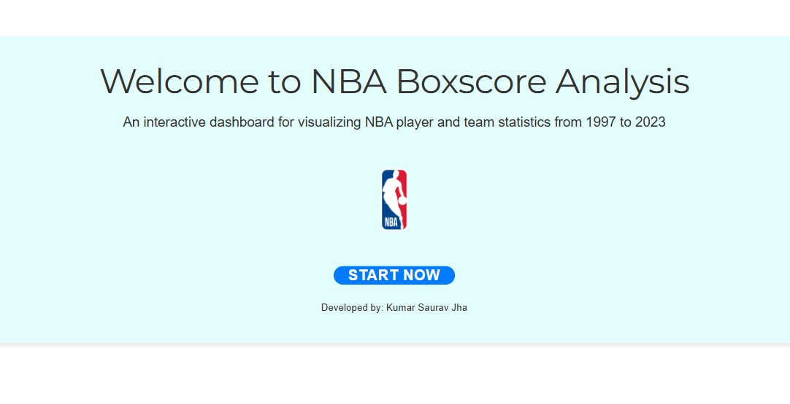
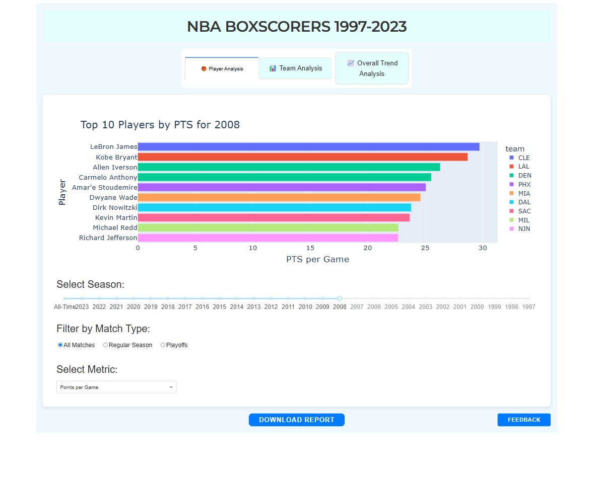
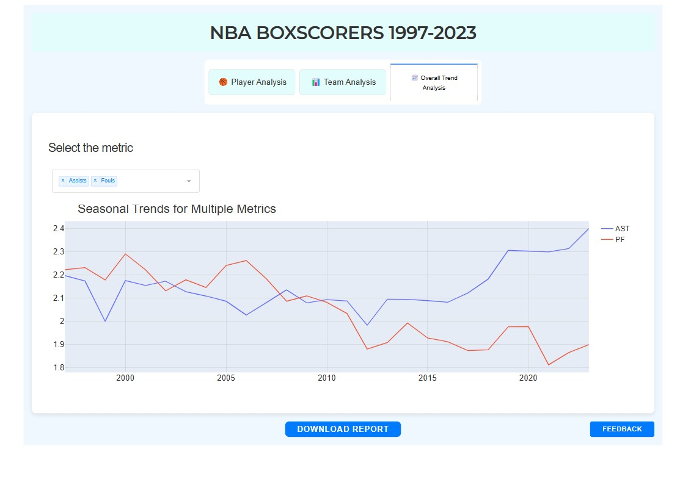

# NBA Player and Season Analysis (1997-2023)



[Click here](https://dashapp-1036289720134.us-east1.run.app/)

## Project Overview
This repository contains a comprehensive analysis and visualization project focused on the performance metrics of NBA players and teams from 1997 to 2023. Using data visualization, statistical analysis, and machine learning techniques, this project uncovers trends, patterns, and actionable insights from over 700,000 NBA game records.



---

## Table of Contents
1. [Project Features](#project-features)
2. [Data Overview](#data-overview)
3. [Dash Application](#dash-application)
4. [Static Analysis](#static-analysis)
5. [Visualizations](#visualizations)
6. [How to Run](#how-to-run)
7. [Future Scope](#future-scope)

---



## Project Features
### Key Functionalities
- **Interactive Dash Application**:
  - Player and team performance analysis.
  - Seasonal trends visualization.
  - Exportable CSV reports.
- **Static Analysis and Visualization**:
  - Exploratory Data Analysis (EDA).
  - Normality test (K-S test)
  - Outlier detection, correlation heatmaps, and PCA.

### Technologies Used
- Dash (for interactive web app development).
- Plotly and Seaborn (for advanced data visualizations).
- Pandas and NumPy (for data manipulation).
- Scikit-learn (for PCA and preprocessing).

---

## Data Overview
- **Dataset**: Scraped from nba.com, hosted on [Kaggle](https://www.kaggle.com/datasets/szymonjwiak/nba-traditional).
- **Records**: 702,387 observations.
- **Features**:
  - **Numerical**: Points (PTS), Assists (AST), Rebounds (REB), Steals (STL), Minutes Played (MIN), Field Goal Percentage (FG%), etc.
  - **Categorical**: Player, Team, Game Type (Regular/Playoff), Season.

---

## Dash Application
### Features
1. **Landing Page**:
   - Welcoming interface with an NBA-themed design.
2. **Tabs**:
   - **Player Analysis**: Focus on individual player statistics.
   - **Team Analysis**: Compare team-level metrics.
   - **Trend Analysis**: Insights into seasonal trends.
3. **Downloadable Reports**:
   - CSV export for Player, Team, and Trend analysis.

---

## Static Analysis
- **Data Cleaning**:
  - Converted columns to appropriate data types.
  - Checked and handled missing values and duplicates.
- **Exploratory Analysis**:
  - Distribution plots for minutes and points.
  - PCA for dimensionality reduction.
  - Heatmaps for correlation analysis.

---

## Visualizations
### Example Plots
1. **Histograms**: Distribution of points and minutes played.
2. **Line Plots**: Seasonal trends in key performance metrics.
3. **Box Plots**: Outlier detection in scoring data.
4. **Heatmaps**: Correlation among numerical features.
5. **Scatter and Regression Plots**: Relationship between scoring and assists.

---

## How to Run
### Prerequisites
- Python 3.8+
- Install dependencies:
  ```bash
  pip install -r requirements.txt
  ```

### Running the Dash Application
1. Clone the repository:
   ```bash
   git clone https://github.com/your-repo-url.git
   ```
2. Navigate to the directory and run the app:
   ```bash
   python FTP_dashboard.py
   ```
3. Open the application in your browser at `http://127.0.0.1:8050`.

### Static Analysis
Run `FTP_static.py` to generate all plots and analyses:
```bash
python FTP_static.py
```

---

## Future Scope
- Incorporate additional metrics like advanced shooting statistics.
- Add predictive models for player performance.
- Enhance visualizations with real-time data integration.
- Optimize the application for larger datasets.
